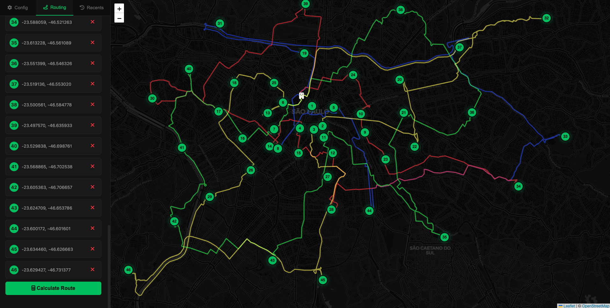

# Aplicação de Planejamento de Rotas VRP

Uma aplicação web para resolução do Problema de Roteamento de Veículos (VRP) com interface de mapa interativo para otimização de rotas.



## Funcionalidades

- Mapa interativo para seleção de pontos
- Configuração de endereço da empresa
- Otimização de rotas usando **algoritmo genético**
- Acompanhamento de progresso em tempo real
- Parâmetros configuráveis do VRP

## Instalação

1. Instalar dependências:
```bash
pip install -r requirements.txt
```

2. Configurar servidor OSRM para roteamento:
```bash
mkdir osrm-data
curl -L -o osrm-data/sao-paulo-latest.osm.pbf https://download.openstreetmap.fr/extracts/south-america/brazil/southeast/sao-paulo.osm.pbf
docker-compose --profile prepare up osrm-data-prep
docker-compose up -d osrm-server
```

3. Executar a aplicação:
```bash
python app.py
```

4. Abrir http://localhost:5002 no navegador

## Como usar

1. Configurar endereço da empresa e parâmetros do VRP na aba Config
2. Adicionar pontos de entrega clicando no mapa ou inserindo coordenadas
3. Clicar em "Calculate Route" para otimizar as rotas de entrega

## Mudando a região do projeto

O projeto utiliza dados do OpenStreetMap em formato `.osm.pbf` para roteamento. Por padrão, está configurado para São Paulo, mas pode ser alterado para qualquer região:

**Fontes de dados disponíveis:**
- **Geofabrik**: https://download.geofabrik.de/
- **OpenStreetMap France**: https://download.openstreetmap.fr/extracts/

**Para alterar a região:**

1. Escolha e baixe o arquivo `.osm.pbf` da região desejada:
```bash
# Exemplo para Rio de Janeiro
curl -L -o osrm-data/rio-de-janeiro-latest.osm.pbf https://download.openstreetmap.fr/extracts/south-america/brazil/southeast/rio-de-janeiro.osm.pbf

# Exemplo para Brasil completo (arquivo grande ~1GB)
curl -L -o osrm-data/brazil-latest.osm.pbf https://download.geofabrik.de/south-america/brazil-latest.osm.pbf
```

2. Atualize o `docker-compose.yml` com o novo nome do arquivo

3. Reconfigure o OSRM:
```bash
docker-compose down
docker-compose --profile prepare up osrm-data-prep
docker-compose up -d osrm-server
```
